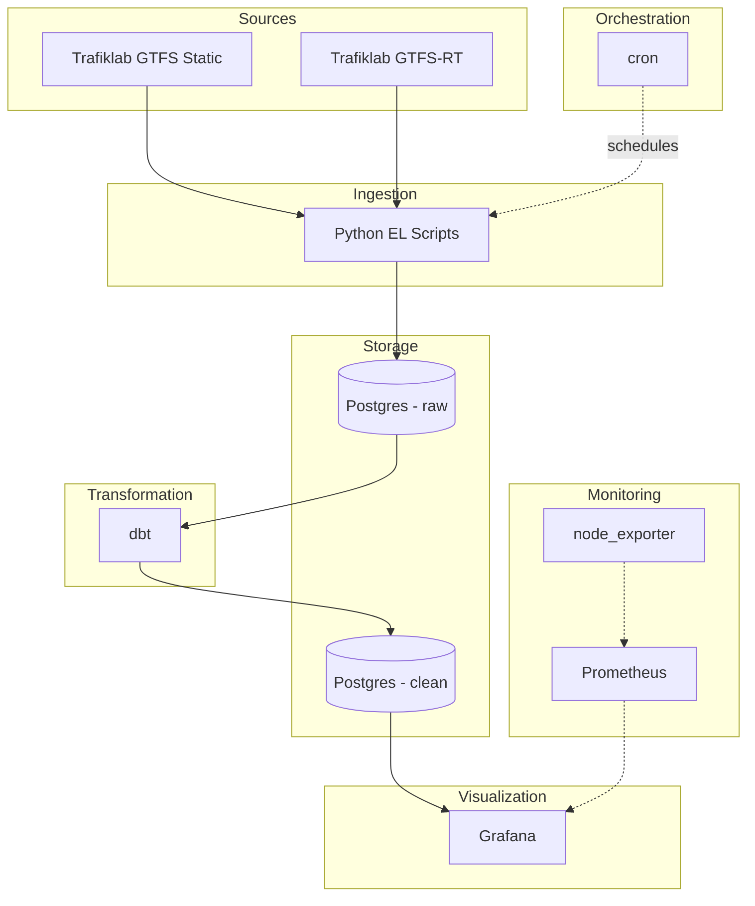

```mermaid
graph TD
    subgraph Sources
        A1[Trafiklab GTFS Static]
        A2[Trafiklab GTFS-RT]
    end

    subgraph Ingestion
        B[Python EL Scripts]
    end

    subgraph Storage
        C[(Postgres - raw)]
        D[(Postgres - clean)]
    end

    subgraph Transformation
        E[dbt]
    end

    subgraph Orchestration
        G[cron]
    end

    subgraph Visualization
        F[Grafana]
    end

    subgraph Monitoring
        H[Prometheus]
        I[node_exporter]
    end

    A1 --> B
    A2 --> B
    B --> C
    C --> E
    E --> D
    D --> F

    G -.->|schedules| B
    I -.-> H
    H -.-> F
```